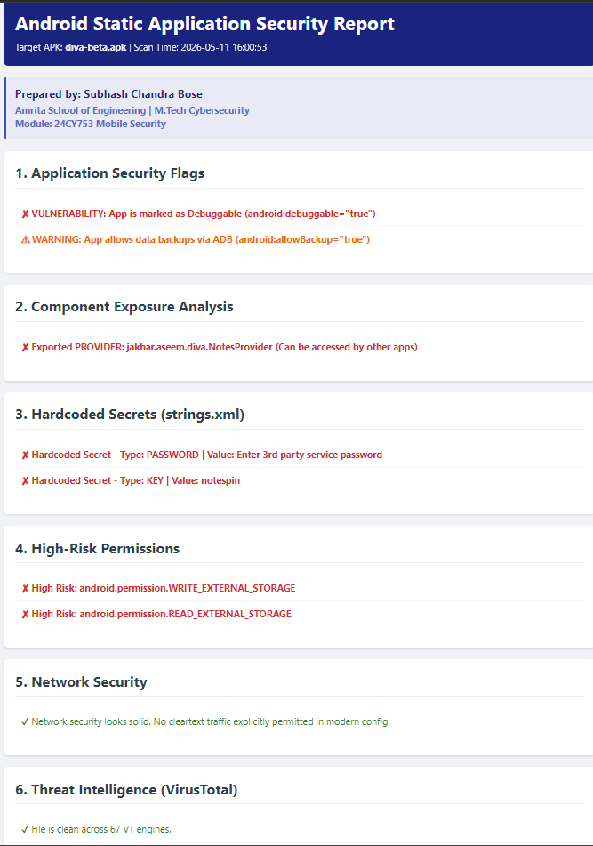
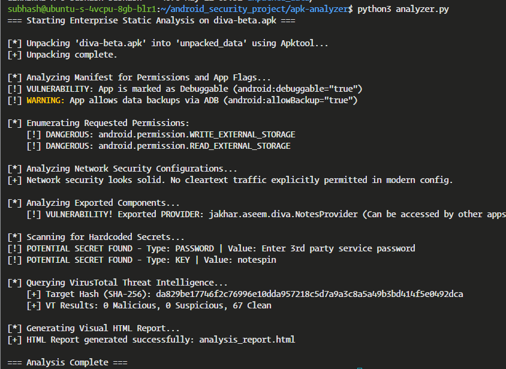

# Enterprise Android SAST Pipeline & Threat Intel Scanner


## 📌 Overview
An automated, enterprise-grade Static Application Security Testing (SAST) tool engineered to identify vulnerabilities in Android applications (APKs). This DevSecOps pipeline automates the reverse engineering process, audits manifest configurations, scrapes for hardcoded credentials, and integrates with cloud threat intelligence to provide a comprehensive security posture assessment.

---

## 📊 Dashboard & Execution Demonstration

> **Note for recruiter/reviewer:** Below are the execution logs and the generated HTML Security Dashboard, demonstrating the automated extraction of secrets, permissions, and threat intelligence.



*Figure 1: Automated HTML Security Dashboard detailing vulnerability findings and VirusTotal telemetry.*



*Figure 2: Real-time CLI execution showing regex parsing, manifest auditing, and API interaction.*

---

## 🚀 Core Features
* **Automated Reverse Engineering:** Utilizes Apktool to programmatically unpack and decompile Android binaries (APK to Smali/XML).
* **Manifest & Component Auditing:** Identifies high-risk developer flags (`debuggable`, `allowBackup`) and improperly exported components (Activities, Services, Providers) to prevent lateral privilege escalation.
* **Hardcoded Secret Discovery:** Employs targeted Regular Expressions (Regex) to extract leaked API keys, authentication tokens, and passwords directly from application resource files (`strings.xml`).
* **Network Security Verification:** Audits application network configurations for insecure cleartext (HTTP) traffic allowances.
* **Threat Intelligence Integration:** Computes cryptographic hashes (SHA-256) of target binaries and queries the **VirusTotal API** for global malware consensus and zero-day threat detection.
* **Enterprise Reporting:** Generates a dynamic, structured HTML dashboard for Security Operations Center (SOC) review and SIEM ingestion readiness.

## 🛠️ Technology Stack
* **Core Language:** Python 3
* **Static Analysis (SAST):** Apktool, XML ElementTree (`xml.etree`), Regular Expressions (`re`)
* **Threat Intelligence & Cryptography:** VirusTotal REST API, SHA-256 Hashing (`hashlib`)
* **Automation & Formatting:** Subprocess automation, OS-level environment variables, automated HTML/CSS generation

## ⚙️ Installation & Usage

### Prerequisites
* Linux/macOS environment (Ubuntu recommended)
* Python 3.8+
* [Apktool](https://ibotpeaches.github.io/Apktool/) installed and added to system PATH.

### Setup Instructions
1. Clone the repository:
   ```bash
   git clone [https://github.com/YOUR_USERNAME/android-sast-pipeline.git](https://github.com/YOUR_USERNAME/android-sast-pipeline.git)
   cd android-sast-pipeline

   pip install requests

   export VT_API_KEY="your_api_key_here"

   python3 analyzer.py path/to/target_app.apk

   ```
Upon completion, the tool generates a comprehensive analysis_report.html file in the working directory.
   
